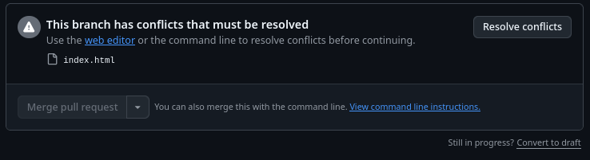
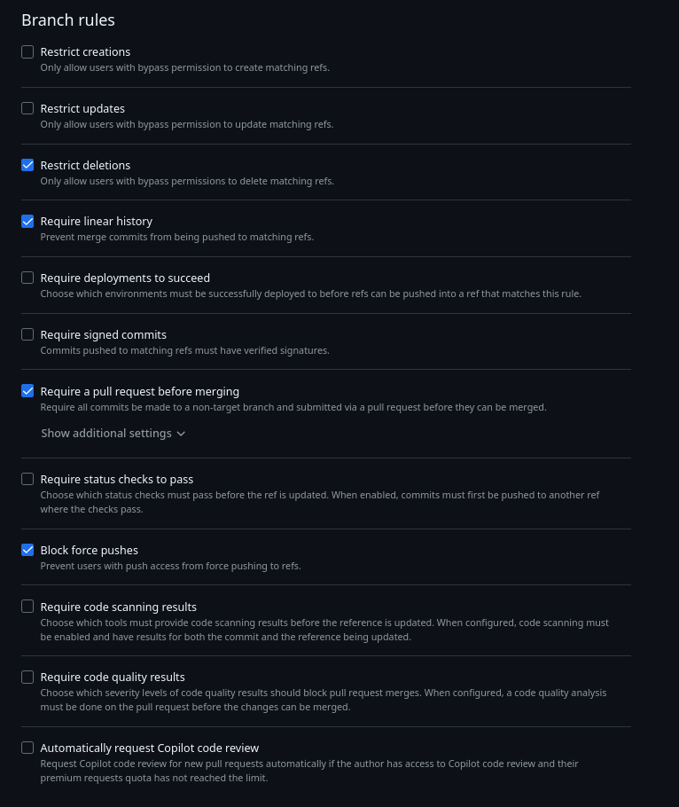

# Praktikum Pemrograman Web - Simulasi Git

## Deskripsi Project
Project ini adalah sebuah landing page perbankan/pinjaman (Loan Service) yang dibangun menggunakan **HTML5**, **Bootstrap 5**, dan **CSS3**. Project ini digunakan sebagai media praktikum untuk mensimulasikan berbagai skenario penggunaan Git, seperti manajemen branch, penyelesaian konflik (conflict resolution), dan interactive rebase (squashing commits).

## Cara Menjalankan
1. Clone repository ini ke komputer lokal Anda.
2. Buka file `index.html` menggunakan browser pilihan Anda (Chrome, Firefox, Edge, dll).
3. Untuk mencoba fitur **Dark Mode**, tekan tombol **'D'** pada keyboard Anda saat halaman terbuka.

## Screenshot Website

## Dokumentasi Perintah Git

Berikut adalah daftar perintah Git yang digunakan dalam praktikum ini beserta penjelasan singkatnya:

### 1. Manajemen Branch
*   `git branch`: Melihat daftar branch yang ada di lokal.
*   `git checkout -b <nama-branch>`: Membuat branch baru dan langsung berpindah ke branch tersebut.
*   `git checkout <nama-branch>`: Berpindah ke branch yang sudah ada.
*   `git branch -D <nama-branch>`: Menghapus branch secara paksa di lokal.

### 2. Alur Kerja Dasar
*   `git status`: Melihat status perubahan pada file di working directory.
*   `git add <nama-file>`: Menambahkan file ke dalam staging area.
*   `git commit -m "<pesan>"`: Menyimpan perubahan dari staging area ke dalam history repository.
*   `git push origin <nama-branch>`: Mengirim commit lokal ke repository remote di GitHub.
*   `git pull origin <nama-branch>`: Mengambil dan menggabungkan perubahan terbaru dari remote ke lokal.

### 3. Simulasi Konflik & Resolusi
*   `git merge <nama-branch>`: Menggabungkan branch lain ke branch saat ini. Jika terdapat perubahan di baris yang sama, Git akan menandai sebagai **Conflict**.
*   **Conflict Resolution**: Dilakukan dengan membuka file yang bermasalah, memilih kode yang ingin dipertahankan (Accept Current, Incoming, atau Both), lalu melakukan `add` dan `commit` ulang.

### 4. Interactive Rebase (Squash)
*   `git rebase -i HEAD~<jumlah_commit>`: Membuka editor interaktif untuk memodifikasi history commit.
*   **Squash**: Teknik menggabungkan beberapa commit kecil menjadi satu commit besar agar history Git menjadi lebih bersih dan rapi.

---
## Lampiran: Dokumentasi GitHub

### 1. Peringatan Konflik di GitHub

Gambar di atas menunjukkan peringatan **"This branch has conflicts that must be resolved"**. Hal ini terjadi karena perubahan yang Anda buat di branch lokal berbenturan dengan perubahan yang sudah ada di branch target pada repository GitHub. Masalah ini harus diselesaikan secara manual sebelum proses *merge* dapat dilanjutkan.

### 2. Aturan Perlindungan Branch (Branch Rules)

Gambar ini menunjukkan konfigurasi **Branch Protection Rules** pada GitHub. Fitur ini digunakan untuk menjaga keamanan kode, dengan aturan seperti:
*   **Require a pull request before merging**: Mewajibkan penggunaan Pull Request (tidak boleh push langsung ke `main`).
*   **Restrict deletions**: Mencegah penghapusan branch utama.
*   **Block force pushes**: Mencegah penggunaan `git push --force` yang dapat merusak riwayat commit.

---
*Praktikum ini disusun untuk memenuhi tugas Pemrograman Web (PPW).*
